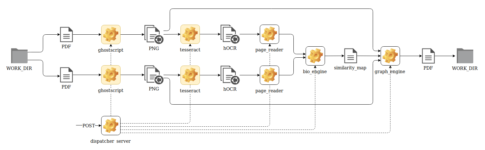

# biotext-similarity

Демо прототипа системы детектирования схожих фрагментов в тестовых документах

Диаграмма работы:

В системе используются CLI инструменты, доступные в дистрибутивах linux:

- ghostscript - для преобразования PDF в PNG
- tesseract-ocr - для распознавания текста из PNG

##### Зависимости

linux: ghostscript, tesseract-ocr

miniconda: python3, jupyter, sklearn, pandas, matplotlib

##### Воспроизводимость

Воспроизведение тетрадок невозможно (тестовые данные недоступны)
